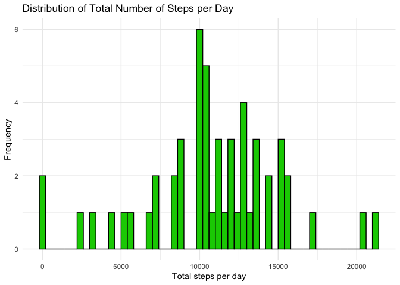
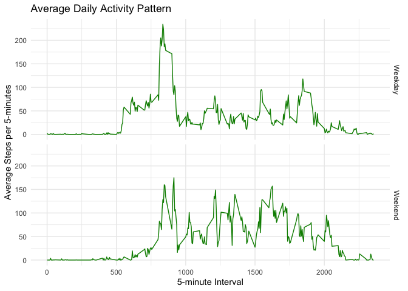

Libraries needed

```r
library(dplyr)
library(timeDate)
library(ggplot2)
```

### Loading and preprocessing the data
Read the csv file and remove rows that do not have data for the steps taken on a given day

```r
activity <- read.csv("activity.csv")
activity <- na.omit(activity)
```

### What is mean total number of steps taken per day?
Since there are many observations per day, I need to aggregate the data by date. Then, I can take the mean and the median of the total steps across all days.

```r
# Get the average steps taken per day
steps_daily <- activity %>%
  group_by(date) %>%
  summarize(steps = sum(steps))
```


```r
mean(steps_daily$steps)
```

```
## [1] 10766.19
```

```r
median(steps_daily$steps)
```

```
## [1] 10765
```

To better illustrate the distribution of the steps in different days, I create a histogram.

```r
# Plot
ggplot(steps_daily, aes(x = steps)) +
  geom_histogram(fill = "green3", color = "black", binwidth = 400) +
  xlab("Total steps per day") +
  ylab("Frequency") +
  ggtitle("Distribution of Total Number of Steps per Day") +
  theme_minimal()
```

<!-- -->

### What is the average daily activity pattern?

In order to track the daily activity pattern, I find the average number of steps per 5-minute interval and plot both variables

```r
# Get the average steps taken per 5-minute interval
steps_int_avg <- activity %>%
  group_by(interval) %>%
  summarize(steps = mean(steps))

# Plot
ggplot(steps_int_avg, aes(interval, steps)) +
  geom_line(color = "green4") +
  xlab("5-minute Interval") +
  ylab("Average Steps per 5-minutes") +
  ggtitle("Average Daily Activity Pattern") +
  theme_minimal()
```

<!-- -->

To figure out which 5-minute interval, on average, contains the greatest number of steps, I can use the same aggregated dataset---steps_int_avg---and ask for the equivalent interval for the highest value in the steps.

```r
# Get the row with the highest value for steps
max_steps <- which(steps_int_avg$steps %in% max(steps_int_avg$steps))
# Get the time interval value for that row
as.character(steps_int_avg[max_steps,1])
```

```
## [1] "835"
```

### Imputing missing values
To estimate the number of NAs in the original dataset, we can just check if all elements are NA and sum the TRUE values.

```r
activity <- read.csv("activity.csv")
sum(is.na(activity$steps))
```

```
## [1] 2304
```

To estipulate a value to substitute these NAs, I use the previous calculation of the average number of steps per 5-minute interval, filling the NAs entries accordingly. More specifically, I loop over the dataset and, if the observation is an NA, fill that with the average number of steps of its respective 5-minute interval. Given the size of the original dataset, I subset the NAs to execute the for loop and then merge the filled data with the original dataset.


```r
# Subset only NAs
activity_NA <- activity[which(is.na(activity$steps)),]
# Subset only non_NAs
activity <- na.omit(activity)

# Fill the NAs with average steps for their respective time intervals
filled_activity_NA <- activity_NA
for (i in 1:nrow(activity_NA)) {
  filled_activity_NA$steps[i] <- as.numeric(steps_int_avg[which(steps_int_avg$interval %in% activity_NA$interval[i]),2])
}

# Merge filled NAs df with non_NA df
filled_activity <- rbind(filled_activity_NA, activity)
```

Now, the dataframe filled_activity mirrors the original activity, but all of the NA observations have been filled. In order to see the difference between the two, we can calculate their mean and median

```r
# Summarize by date
steps_daily_filled <- filled_activity %>%
  group_by(date) %>%
  summarize(steps = sum(steps))

# Mean before NAs were filled
mean(steps_daily$steps)
```

```
## [1] 10766.19
```

```r
# Mean after NAs were filled
mean(steps_daily_filled$steps)
```

```
## [1] 10766.19
```

```r
# Median before NAs were filled
median(steps_daily$steps)
```

```
## [1] 10765
```

```r
# Median after NAs were filled
median(steps_daily_filled$steps)
```

```
## [1] 10766.19
```

As expected, filling the NAs with the average values of the rest of the dataset did not affect the mean and median of the entire data. However, this does not mean that filled_NAs have no effect on summary statistics, as exemplified below:

```r
# Total number of steps before NA-fill
sum(steps_daily$steps)
```

```
## [1] 570608
```

```r
# Total number of steps after NA-fill
sum(steps_daily_filled$steps)
```

```
## [1] 656737.5
```

Because I manually changed the observations, now the data indicates the subjects walked much more than they actually did. In other words, by inputting data, I implied that the subject walked during days that, in reality, they did not---at least not according to the original data collection. 

### Are there differences in activity patterns between weekdays and weekends?

By creating a new variable that divides the dates between weekdays and weekends, I am able to create and compare two time-series of steps over time intervals. First, I use the timeDate package to divide the dates into these two categories efficiently. Then, I take the average of steps taken for each of these factors.


```r
# Create new column with factor Weekday/Weekend
activity$weekday <- as.factor(ifelse(isWeekday(as.Date(activity$date)), "Weekday", "Weekend"))

# Group by weeeday and interval and average the steps
steps_week_int_avg <- activity %>%
  group_by(weekday, interval) %>%
  summarize(steps = mean(steps))
```

```
## `summarise()` has grouped output by 'weekday'. You can override using the `.groups` argument.
```

```r
# Plot
ggplot(steps_week_int_avg, aes(interval, steps)) +
  geom_line(color = "green4") +
  facet_grid(vars(weekday)) +
  xlab("5-minute Interval") +
  ylab("Average Steps per 5-minutes") +
  ggtitle("Average Daily Activity Pattern") +
  theme_minimal()
```

<!-- -->

